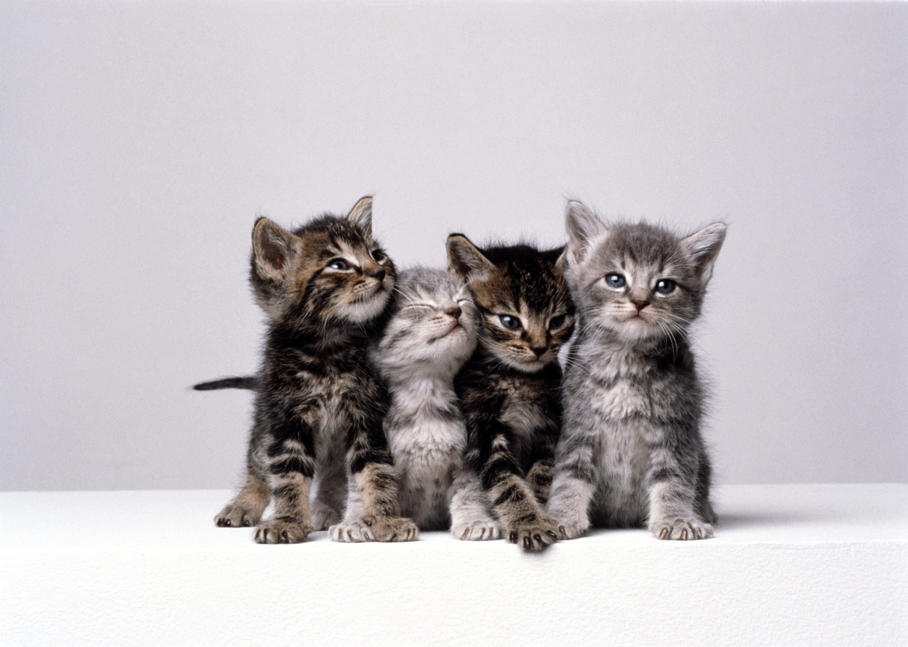

# baiba.zaikovska
# About me
My name is Baiba, and I have never imagined myself working in IT field. However, lately I got the feeling that it is something I should at least try, so I started to look for ways where a person, whose education is based in humanities, could start a different path, moving towards something new and completely different. This is how I found software testing.
### Work
Currently I'm working in a translation agency as a *Language Quality Assurance Specialist*. Although the quality of the final "product" is the main issue I deal with daily, the field of my work is closely related to languages and linguistics rather than IT. On the other hand, there are different types of [CAT tools](https://en.wikipedia.org/wiki/Computer-assisted_translation) that I must use, and they require more technical and computer-based skills rather than language-related ones. And yes - these tools have absolutely nothing to do with cats, but nevertheless - here is a cute picture with them: 
### Hobbies
In my free time I like to:
* do different types of puzzles (**jigsaw, diamond, crosswords** etc., but in general - the more complicated, meticulous or work-consuming, the better, because the satisfactions once they are finished is even bigger);
* go hiking;
* ride a bicycle;
* swim;
* go on different trips to see new places;
* cook and try new recipes.
